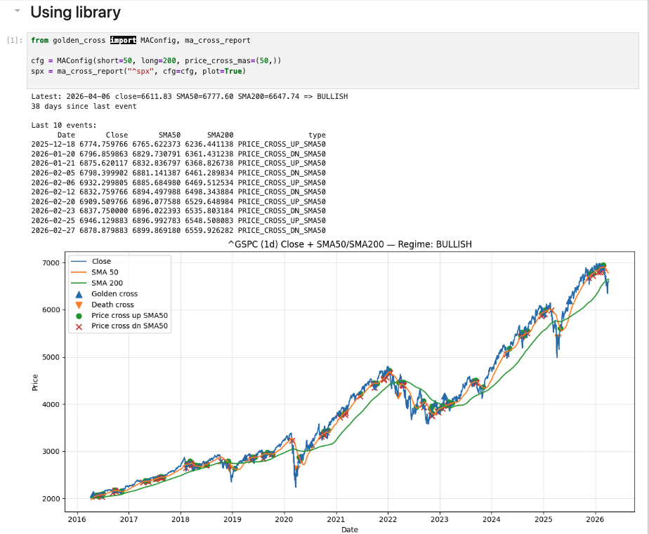

# golden-cross

A small Python library and CLI extracted from the attached notebook.

It keeps the original workflow idea intact:
- fetch OHLCV data
- compute SMA short/long regime changes
- list golden/death cross events
- optionally plot the result



## Install

```bash
pip install -e .
```

With parquet support:

```bash
pip install -e .[parquet]
```

## CLI usage

```bash
golden-cross report btcusd --interval 1d
golden-cross report spy.us --interval 1d --start 2020-01-01 --no-plot
golden-cross report ^spx --short 50 --long 200 --price-cross-ma 50 --price-cross-ma 20
```

## Python usage

```python
from golden_cross import MAConfig, ma_cross_report

report = ma_cross_report(
    symbol="btcusd",
    interval="1d",
    cfg=MAConfig(short=50, long=200, price_cross_mas=(50,)),
    plot=False,
)

print(report.latest)
print(report.events.tail())
```

## Cache behavior

The cache stores one file per `(provider, symbol, interval)` plus a sidecar metadata file.

Default cache directory:

```text
~/.cache/golden_cross/
```

Refresh strategy:
- first request: fetch requested range, or `max` if no range is provided
- later requests: fetch only missing left-side history and a small recent tail window
- unbounded requests (`start=None`, `end=None`) now self-heal older partial caches by fetching `max` once and marking the cache as full-history
- recent tail refresh corrects revised latest bars without re-downloading the full history
